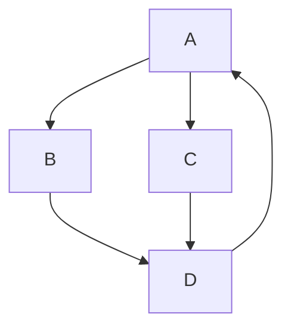
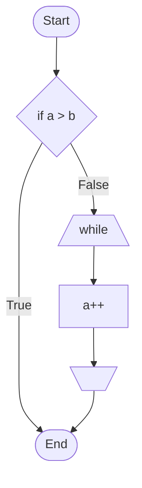
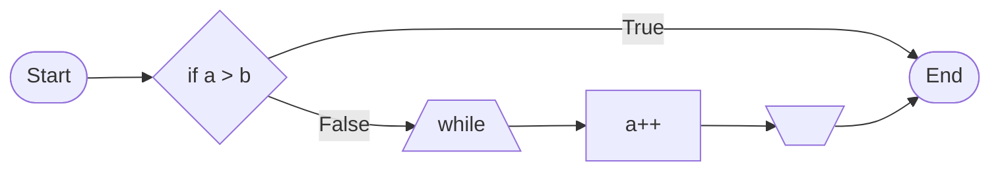
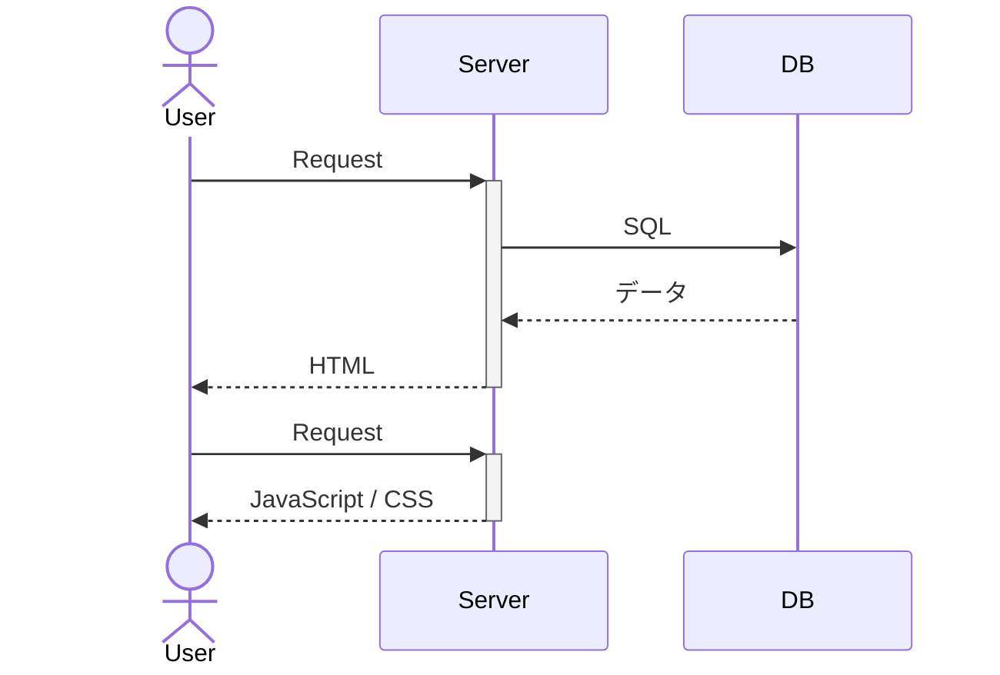
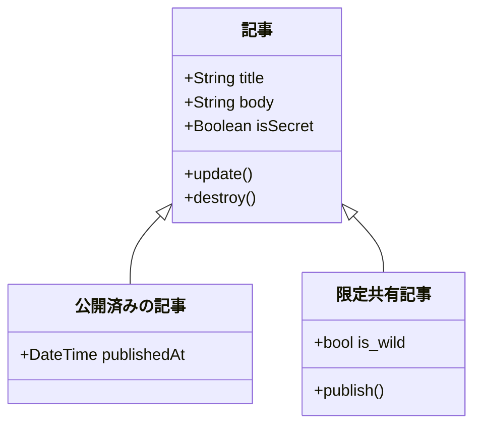

# Mermaidの書き方トレーニング
## 基本形

```mermaid
graph TD;
    A-->B;
    A-->C;
    B-->D;
    C-->D;
    D-->A
```

## 縦書き

```mermaid
graph TB
  Start([Start])-->B{if a > b}
  B-->|True| End
  B-->|False| IFS[/while\]
  IFS-->C[a++]
  C-->IFB[\  /]
  IFB-->End([End])
```
## 横向き

```mermaid
graph LR
  Start([Start])-->B{if a > b}
  B-->|True| End
  B-->|False| IFS[/while\]
  IFS-->C[a++]
  C-->IFB[\  /]
  IFB-->End([End])
```

## シーケンス図

```mermaid
sequenceDiagram
  actor U as User
  participant S as Server
  participant DB
  U->>+S: Request
  S->>DB: SQL
  DB-->>S: データ
  S-->>-U: HTML
  U->>+S: Request
  S-->>-U: JavaScript / CSS
```

## クラス図

```mermaid
classDiagram
  記事 <|-- 公開済みの記事
  記事 <|-- 限定共有記事
  class 記事{
    +String title
    +String body
    +Boolean isSecret
    +update()
    +destroy()
  }
  class 公開済みの記事{
    +DateTime publishedAt
  }
  class 限定共有記事{
    +bool is_wild
    +publish()
  }
```
